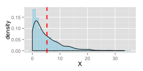
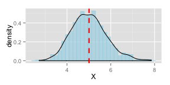
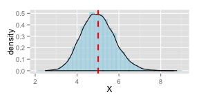
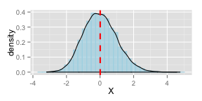

####Overview:

The goal of this project is to do some simple inferential data analysis. In this project I will investigate an exponential distribution and compare it with the Central Limit Theorem (CLT).

####Simulations:

The exponential distribution is expressed in R with rexp(n, lambda) where n is the number of exponentials and lambda is the rate parameter.  I will set n = 40 exponentials and lambda = 0.2 for all of the simulations.  I will investigate the distribution of averages of 40 exponentials by doing 1000 simulations. (Appendix: A)


####Sample Mean versus Theoretical Mean:

Using the parameters given I show the sample mean. (Appendix: B)


```
## [1] 5.006655
```


Now I compare sample mean to theoretical mean of the distribution.  I calculate the mean using the formula 1/lambda. (Appendix: C)


```
## [1] 5
```
Sample mean 5.01 is very close to the theoretical mean 5.

####Sample Variance versus Theoretical Variance:

I show variance of the averages of exponentials. (Appendix: D)


```
## [1] 0.626949
```

Now I compare sample variance to theoretical variance of the distribution.  To find theoretical variance, I use formula S^2/n. S^2 is a sample variance of the exponential distribution, 5^2 = 25. n is the number of exponentials, 40. (Appendix: E)


```
## [1] 0.625
```
Sample variance 0.627 is close to the theoretical variance 0.625.

####Distribution:

First I show the distribution of a large collection of random exponentials.  I use 1000 random exponentials.  Plotting a histogram and a density curve shows how the distribution is shaped.  A red vertical line is drawn to indicate the sample mean of the distribution. (Appendix: F)

 

As you can see from above density graph, the distribution of a large collection of exponentials is not normal.  Next, I show the distribution of 1000 averages of 40 exponentials. (Appendix: G)

 

Below I show 10000 averages of 40 exponentials. (Appendix: H)

 

Distribution is tighter around the mean.

Now I use the formula z = (mean - mu)/standard error to check for normality. Standard error is s/sqrt(n).
Here's the distribution for 10000 averages of 40 exponentials. (Appendix: I)

 

Showing the sample mean and standard deviation. (Appendix: J)


```
## [1] 0.008008566
```

```
## [1] 0.9963791
```

####Conclusion:
My conclusion is that as n gets larger, the distribution of averages of exponentials becomes that of a standard normal.  For n = 10000, mean is 0.0080 and standard deviation is 0.9966.  Sample mean is approximately equal to 0 and sample standard deviation is approximately equal to 1.  Therefore, the distribution is approximately normal.

####Appendix:
R codes used in this report are shown.

(A)

```r
set.seed(1518)
means <- NULL
lambda <- 0.2
n <- 40
for(i in 1:1000)
        means = c(means, mean(rexp(n, lambda)))
```
(B)

```r
mean(means)
```
(C)

```r
meant <- 1/lambda
print(meant)
```
(D)

```r
var(means)
```
(E)

```r
s <- 1/lambda
vart <- s^2/n
print(vart)
```
(F)

```r
library(ggplot2)
meanl <- rexp(1000, lambda)
dataset1 <- data.frame(X = meanl)
g <- ggplot(dataset1, aes(x = X))
g + geom_histogram(aes(y = ..density..), color = "light blue", fill = "light blue", alpha = .7, bindwidth = .5) + geom_density() + geom_vline(aes(xintercept = mean(meanl)), linetype = "dashed", size = 1, color = "red")
```
(G)

```r
dataset2 <- data.frame(X = means)
g <- ggplot(dataset2, aes(x = X))
g + geom_histogram(aes(y = ..density..), color = "light blue", fill = "light blue", alpha = .7, bindwidth = .5) + geom_density() + geom_vline(aes(xintercept = mean(means)), linetype = "dashed", size = 1, color = "red")
```
(H)

```r
meanx <- NULL
for(i in 1:10000)
        meanx = c(meanx, mean(rexp(n, lambda)))
dataset3 <- data.frame(X = meanx)
g <- ggplot(dataset3, aes(x = X))
g + geom_histogram(aes(y = ..density..), color = "light blue", fill = "light blue", alpha = .7, bindwidth = .5) + geom_density() + geom_vline(aes(xintercept = mean(meanx)), linetype = "dashed", size = 1, color = "red")
```
(I)

```r
z <- (meanx-meant)/(s/sqrt(n))
dataset4 <- data.frame(X = z)
g <- ggplot(dataset4, aes(x = X))
g + geom_histogram(aes(y = ..density..), color = "light blue", fill = "light blue", alpha = .7, bindwidth = .5) + geom_density() + geom_vline(aes(xintercept = mean(z)), linetype = "dashed", size = 1, color = "red")
```
(J)

```r
mean(z)
sqrt(var(z))
```
